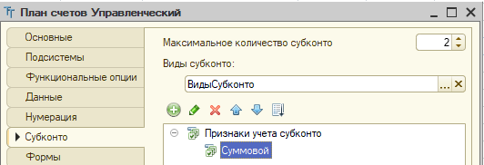
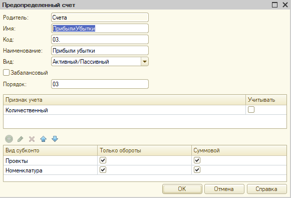
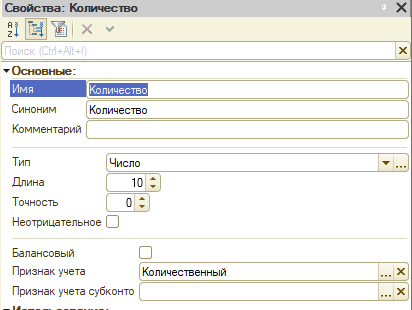
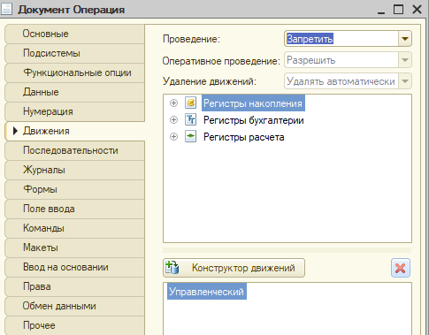

# Билет 1 - решение задачи по бух. учёту

**Дисклеймер** Данные записи, по-сути, практическая выжимка решения, теор. часть практически не разбирается! Поэтому важен теоретических базис от любого доступного источника: Курс 1С УЦ, Курс Гилёва, Курс Чистова, практическое пособие разработчика и т.д.

## Анализ билета

---

Выделяем ключевые особенности решения 1-2 словами, чтобы потом по этому чек-листу разрабатывать решение

* Используемые документы: "Расходная накладная", "Затраты"
* Создать документ "Операция"
* Учет в разрезе проектов / проект в шапке
* Учет в разрезе складов / склад в шапке
* Себестоимость - средняя по товару между всеми складами
* Затраты вносятся в тот же день, что и продажи
* В отчете есть количество и 3 разных суммы

Полезно выписать проводки на листок, чтобы потом не смотреть в билет:

* Расходная накладная
  * *ДТ "Прибыли и убытки" = КТ "Товары" на сумму себестоимости*
  * *ДТ "Покупатели" = КТ "Прибыли и убытки" на сумму в продажных ценах*

* Затраты
  * *ДТ "Прибыли и убытки" = КТ "Общехозяйственные затраты" на сумму себестоимости*

**Проектируем учётную схему для получения нужных показателей учёта!**

* Определяем список аналитик
  * В отчете 2 аналитики: *Товар* и *проект*
  * В тексте билета упоминался склад и по нему идёт контроль остатков, поэтому будет ещё 1 аналитика *Склад*
  * Итого 3 аналитики: *Товар*, *Проект*, *Склад*
    * Все аналитики будут заведены как *Субконто*, потому что их надо включить только для некоторых счетов

* Особенности Субконто *Склад*
  * Для субконто *Склад* на счете *Товары* необходимо отключить суммовой учёт, т.к. *Себестоимость - средняя по товару между всеми складами*
  
* Нюансы проведения документов
  * При проведении документа *Затраты* мы НЕ будем заполнять субконто *Номенклатура* (ни слова не сказано в ТЗ), только *Проект*
    * Более того ввели упрощение, что затраты задним числом НЕ вводятся (фраза: *Документы вводятся по мере поступления затрат в течение дня. Считается, что все затраты должны быть отнесены в счет продаж текущего дня*)
  * при проведении документа *Расходная накладная* будем заполнять не только сумму, но ещё и количество
    * Да в проводках про это не сказано, но **показатель есть в отчете**

* Определяем как получать показатели отчета

  * Все документы у нас затрагивают счёт *Прибыли и убытки*, значит отчёт будем строить по нему
    * Для отчёта на счёт нужно будет добавить 2 субконто: *Номенклатура* и *Проект*
    * У обоих субконто надо будет включить флаг *Только обороты* так как в нашей учётной схеме остатки на данном счёте не нужны
      * Если флаг НЕ поставить - ошибка на экзамене

  * Количество товара
    * В проводках НЕ упоминается количество, но в отчёте оно есть, значит должен быть ресурс *Количество*. Настройки этого ресурса одинаковы для всех задач:
      * Заводится признак ведения учета *Количественный*
      * Признак подключается к нужному счету (в нашем случае это счет *Товары*)
      * У ресурса регистра отключить признак *балансовый*

  * Себестоимость товара
    * Это *сумма оборот ДТ* с фильтром на не пустое субконто *Номенклатура*
      * т.к. документ затраты это субконто НЕ заполняет
  
  * Сумма продажи товара
    * Это *сумма оборот КТ* без фильтров

  * Сумма затрат
    * Это *сумма оборот ДТ* с фильтром на не пустое субконто *Номенклатура*

* В данной задаче НИЧЕГО не сказано про услуги, но про услуги сказано в задаче по ОУ, поэтому и тут нужно будет фильтровать данные.

**ВАЖНО! Актуально для всех задач всех учётов** Подобный анализ требуется делать ВСЕГДА ДО решения билета, а то потом возможны ситуации, когда отчет не собирается!

### Подготовка объектов метаданных

* Создаём новый справочник *"Склады"*
  * Создаём 2 предопределённых склада: "Основной" и "Транзитный"
  * требуется для *Учет в разрезе складов / склад в шапке*

* Создаём новый справочник *"Проекты"*
  * Создаём 2 предопределённых склада: "Проект1" и "Проект2"
  * требуется для *Учет в разрезе проектов / проект в шапке*

* Создаём реквизит шапки "Склад" в документе *Расходная накладная*
  * Не забываем ставить признак *Проверка заполнения* в *Выдавать ошибку*
  * Требуется для *Учет в разрезе складов / склад в шапке*

* Создаём документ *Затраты*
  * Реквизитов нет
  * Создаем табличную часть *Проекты*
    * 2 реквизита: *Проект* (тип: *СправочникСсылка.Проекты*) и *Сумма*

* Настраиваем план видов характеристик *Виды субконто*
  * Субконто *Номенклатура* уже есть в каркасной конфигурации
  * Добавляем необходимые типы в настройки ПВХ
    * в нашем случае: *Склады*, *Проекты*
  * Добавляем новые виды субконто в предопределённые:
    * *Склады* (*СправочникСсылка.Склады*)
    * *Проекты* (*СправочникСсылка.Проекты*)
  * Требуется для **всех** ключевых особенностей билета

    

* Настраиваем план счетов *Управленческий*
 
  * Вкладка *"Данные"*

    * Добавляем признак учёта *Количественный* - настраиваем признаки учёта по счетам
      * Товары должны списываться по количеству, значит нужен будет ресурс *Количество*
      * Ресурс количество в разрезе задачи важен только для 1 счёт *Товары*, значит нужен признак, позволяющий **включить** учёта по количеству для этого счёта
  
    

  * Вкладка *"Субконто"*

    * Привязываем ПВХ *"Виды субконто"* - настраиваем субконто

    * Выставляем макс. количество субконто
      * в процессе анализа выявлено 2 аналитики
      * Отчет строится только через счёт *Товары* и обе аналитики участвуют в отчете, значит на нём должно быть 2 субконто
      * Других аналитик нет, значит макс. количество субконто = 2

    * Добавляем признак учёта субконто *"Суммовой"*
      * Себестоимость считает по товару в целом, значит показатель суммы для субконто "Срок годности" для нас неважен
      * В отчете сумма - это расчетный показатель, значит для вывода нам сумма не нужна
      * Вывод: на субконто "Срок годности" нет нужны вести суммовой учёт, поэтому требуется признак **отключения** учёта по сумме
  
    

  * Вкладка *"Прочее"* - *"Предопределенные"* - настраиваем счета
    
    * Дополнительные настройки нужны для счета *Товары* и * Прибыли и убытки*

    

    * Настройка счета *Товары*
      * Включаем признак учета *Количественный*
      * Добавляем 2 субконто: *Номенклатура* и *Склады*

    

    * Настройка счета *Склады*
      * Признак учета *Количественный* НЕ включаем
      * Добавляем 2 субконто: *Проекты* и *Номенклатура*

    

  * Требуется для **всех** ключевых особенностей билета
  
* Создаём регистр бухгалтерии *Управленческий*

  * Вкладка *"Основные"*
    * Привязываем регистру план счетов *Управленческий*
    * Включаем флаг *Корреспонденция* - этот флаг на экзамен включается всегда

    

  * вкладка *"Данные"*
    * Измерений нет
    * Ресурсы
      * *Сумма* (тип: *число(12,2)*)- будет всегда в любой задаче
        * Выставляем *Признак учёта субконто* - *Суммовой*
        * флаг "Балансовый" *должен быть включен*
  
      
    
      * *Количество* (тип: *число(10,0)*)
        * Выставляем *Признак учёта* - *Количественный*
        * флаг "Балансовый" *должен быть выключен*

      

  * Вкладка *"Регистраторы"*
  
    * Добавляем наши документы

    

* Создаём документ *"Операция"*
  * Вкладка *"Движения"*
    * Признак *Проведение* - *Запретить*
    * Выбрать наш регистр *Управленческий*

    

  * Создаем форму документа
    * Выводим *Объект* - *Движения* - *Управленческий* - на форму документа

    

  * Требуется для *Создать документ "Операция"*

