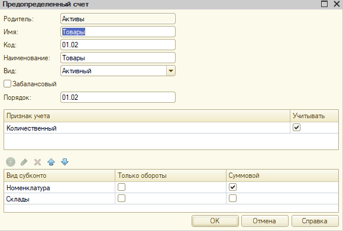
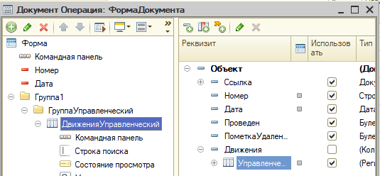
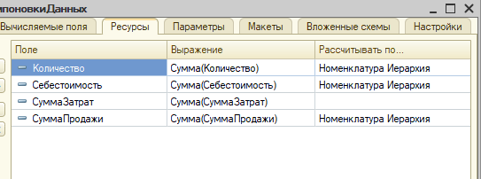
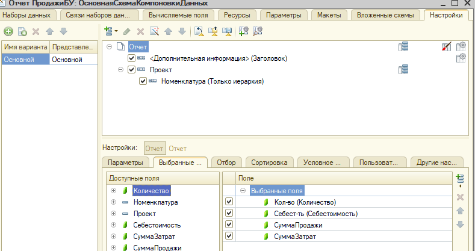
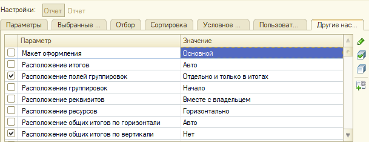

# Билет 1 - решение задачи по бух. учёту

**Дисклеймер** Данные записи, по-сути, практическая выжимка решения, теор. часть практически не разбирается! Поэтому важен теоретических базис от любого доступного источника: Курс 1С УЦ, Курс Гилёва, Курс Чистова, практическое пособие разработчика и т.д.

## Анализ билета

---

Выделяем ключевые особенности решения 1-2 словами, чтобы потом по этому чек-листу разрабатывать решение

* Используемые документы: "Расходная накладная", "Затраты"
* Создать документ "Операция"
* Учет в разрезе проектов / проект в шапке
* Учет в разрезе складов / склад в шапке
* Себестоимость - средняя по товару между всеми складами
* Затраты вносятся в тот же день, что и продажи
* В отчете есть количество и 3 разных суммы

Полезно выписать проводки на листок, чтобы потом не смотреть в билет:

* Расходная накладная
  * *ДТ "Прибыли и убытки" = КТ "Товары" на сумму себестоимости*
  * *ДТ "Покупатели" = КТ "Прибыли и убытки" на сумму в продажных ценах*

* Затраты
  * *ДТ "Прибыли и убытки" = КТ "Общехозяйственные затраты" на сумму себестоимости*

**Проектируем учётную схему для получения нужных показателей учёта!**

* Определяем список аналитик
  * В отчете 2 аналитики: *Товар* и *проект*
  * В тексте билета упоминался склад и по нему идёт контроль остатков, поэтому будет ещё 1 аналитика *Склад*
  * Итого 3 аналитики: *Товар*, *Проект*, *Склад*
    * Все аналитики будут заведены как *Субконто*, потому что их надо включить только для некоторых счетов

* Особенности Субконто *Склад*
  * Для субконто *Склад* на счете *Товары* необходимо отключить суммовой учёт, т.к. *Себестоимость - средняя по товару между всеми складами*
  
* Нюансы проведения документов
  * При проведении документа *Затраты* мы НЕ будем заполнять субконто *Номенклатура* (ни слова не сказано в ТЗ), только *Проект*
    * Более того ввели упрощение, что затраты задним числом НЕ вводятся (фраза: *Документы вводятся по мере поступления затрат в течение дня. Считается, что все затраты должны быть отнесены в счет продаж текущего дня*)
  * при проведении документа *Расходная накладная* будем заполнять не только сумму, но ещё и количество
    * Да в Движениях про это не сказано, но **показатель есть в отчете**

* Определяем как получать показатели отчета

  * Все документы у нас затрагивают счёт *Прибыли и убытки*, значит отчёт будем строить по нему
    * Для отчёта на счёт нужно будет добавить 2 субконто: *Номенклатура* и *Проект*
    * У обоих субконто надо будет включить флаг *Только обороты* так как в нашей учётной схеме остатки на данном счёте не нужны
      * Если флаг НЕ поставить - ошибка на экзамене

  * Количество товара
    * В Движениях НЕ упоминается количество, но в отчёте оно есть, значит должен быть ресурс *Количество*. Настройки этого ресурса одинаковы для всех задач:
      * Заводится признак ведения учета *Количественный*
      * Признак подключается к нужному счету (в нашем случае это счет *Товары*)
      * У ресурса регистра отключить признак *балансовый*

    * Как доставать количество для отчета?
      * будет доставать из конкретной проводки между счётом *Прибыли и убытки* и *Товары*
      * У виртуальной таблицы оборотов можно отбираться по конкретным Движением (*КорСчета*), что нам на руку. Подробнее будет в описании создания отчета

  * Себестоимость товара
    * Это *сумма оборот ДТ* с фильтром на не пустое субконто *Номенклатура*
      * т.к. документ затраты это субконто НЕ заполняет
  
  * Сумма продажи товара
    * Это *сумма оборот КТ* без фильтров

  * Сумма затрат
    * Это *сумма оборот ДТ* с фильтром на не пустое субконто *Номенклатура*

* В данной задаче НИЧЕГО не сказано про услуги, но про услуги сказано в задаче по ОУ, поэтому и тут нужно будет фильтровать данные.

* В задаче ничего не сказано про документ *Приходная накладная*, значит поступление товара можно будет ввести документом операция, поэтому настройку данного документа пропустим

**ВАЖНО! Актуально для всех задач всех учётов** Подобный анализ требуется делать ВСЕГДА ДО решения билета, а то потом возможны ситуации, когда отчет не собирается!

### Подготовка объектов метаданных

* Создаём новый справочник *"Склады"*
  * Создаём 2 предопределённых склада: "Основной" и "Транзитный"
  * требуется для *Учет в разрезе складов / склад в шапке*

* Создаём новый справочник *"Проекты"*
  * Создаём 2 предопределённых склада: "Проект1" и "Проект2"
  * требуется для *Учет в разрезе проектов / проект в шапке*

* Создаём реквизиты шапки *Проект* и *Склад* в документе *Расходная накладная*
  * Не забываем ставить признак *Проверка заполнения* в *Выдавать ошибку*
  * Требуется для *Учет в разрезе складов / склад в шапке*
  * Требуется для *Учет в разрезе проектов / проект в шапке*

* Создаём документ *Затраты*
  * Реквизитов нет
  * Создаем табличную часть *Проекты*
    * 2 реквизита: *Проект* (тип: *СправочникСсылка.Проекты*) и *Сумма*

* Настраиваем план видов характеристик *Виды субконто*
  * Субконто *Номенклатура* уже есть в каркасной конфигурации
  * Добавляем необходимые типы в настройки ПВХ
    * в нашем случае: *Склады*, *Проекты*
  * Добавляем новые виды субконто в предопределённые:
    * *Склады* (*СправочникСсылка.Склады*)
    * *Проекты* (*СправочникСсылка.Проекты*)
  * Требуется для **всех** ключевых особенностей билета

    

* Настраиваем план счетов *Управленческий*

  * Вкладка *"Данные"*

    * Добавляем признак учёта *Количественный* - настраиваем признаки учёта по счетам
      * Товары должны списываться по количеству, значит нужен будет ресурс *Количество*
      * Ресурс количество в разрезе задачи важен только для 1 счёт *Товары*, значит нужен признак, позволяющий **включить** учёта по количеству для этого счёта
  
    

  * Вкладка *"Субконто"*

    * Привязываем ПВХ *"Виды субконто"* - настраиваем субконто

    * Выставляем макс. количество субконто
      * в процессе анализа выявлено 2 аналитики
      * Отчет строится только через счёт *Товары* и обе аналитики участвуют в отчете, значит на нём должно быть 2 субконто
      * Других аналитик нет, значит макс. количество субконто = 2

    * Добавляем признак учёта субконто *"Суммовой"*
      * Себестоимость считает по товару в целом, значит показатель суммы для субконто "Срок годности" для нас неважен
      * В отчете сумма - это расчетный показатель, значит для вывода нам сумма не нужна
      * Вывод: на субконто "Срок годности" нет нужны вести суммовой учёт, поэтому требуется признак **отключения** учёта по сумме
  
    

  * Вкладка *"Прочее"* - *"Предопределенные"* - настраиваем счета

    * Дополнительные настройки нужны для счета *Товары* и *Прибыли и убытки*

    

    * Настройка счета *Товары*
      * Включаем признак учета *Количественный*
      * Добавляем 2 субконто: *Номенклатура* и *Склады*

    

    * Настройка счета *Склады*
      * Признак учета *Количественный* НЕ включаем
      * Добавляем 2 субконто: *Проекты* и *Номенклатура*

    

  * Требуется для **всех** ключевых особенностей билета
  
* Создаём регистр бухгалтерии *Управленческий*

  * Вкладка *"Основные"*
    * Привязываем регистру план счетов *Управленческий*
    * Включаем флаг *Корреспонденция* - этот флаг на экзамен включается всегда

    

  * вкладка *"Данные"*
    * Измерений нет
    * Ресурсы
      * *Сумма* (тип: *число(12,2)*)- будет всегда в любой задаче
        * Выставляем *Признак учёта субконто* - *Суммовой*
        * флаг "Балансовый" *должен быть включен*
  
      

      * *Количество* (тип: *число(10,0)*)
        * Выставляем *Признак учёта* - *Количественный*
        * флаг "Балансовый" *должен быть выключен*

      

  * Вкладка *"Регистраторы"*

    * Добавляем наши документы

    

* Создаём документ *"Операция"*
  * Вкладка *"Движения"*
    * Признак *Проведение* - *Запретить*
    * Выбрать наш регистр *Управленческий*

    

  * Создаем форму документа
    * Выводим *Объект* - *Движения* - *Управленческий* - на форму документа

    

  * Требуется для *Создать документ "Операция"*

### Настройка документа "Расходная накладная"

* Методика проведения по регистру бухгалтерии практически всегда старая, в силу специфики этого регистра

* При установке блокировки важно помнить:
  * всегда надо блокировать счёт, к которому делаем запрос (иначе ошибка *избыточная блокировка*)
  * при блокировке по субконто всегда указывать предопределённый элемент ПВХ в качестве 1го параметра, а не строку)

* Чтобы гарантировать правильные отборы при любом порядке субконто у виртуально таблицы есть специальный параметр - "Субконто" - в него надо всегда передавать массив субконто в том порядке, в котором вы их используете в запросе
  * подробнее см. пример в билете 1

* Код решения:

```1C
    Движения.Управленческий.Записывать = Истина;
    Движения.Управленческий.Записать();
    
    // Установка блокировки данных в регистре Управленческий по списку номенклатур табличной части
    Блокировка = Новый БлокировкаДанных;
    ЭлементБлокировки = Блокировка.Добавить("РегистрБухгалтерии.Управленческий");
    ЭлементБлокировки.УстановитьЗначение("Счет", ПланыСчетов.Управленческий.Товары);
    ЭлементБлокировки.Режим = РежимБлокировкиДанных.Исключительный;
    ЭлементБлокировки.ИсточникДанных = СписокНоменклатуры;
    ЭлементБлокировки.ИспользоватьИзИсточникаДанных(ПланыВидовХарактеристик.ВидыСубконто.Номенклатура, "Номенклатура");
    Блокировка.Заблокировать();
    
    // Запрос получения данных для формирования движений
    Запрос = Новый Запрос;
    Запрос.Текст = 
    "ВЫБРАТЬ
    |    РасходнаяНакладнаяСписокНоменклатуры.Номенклатура КАК Номенклатура,
    |    СУММА(РасходнаяНакладнаяСписокНоменклатуры.Количество) КАК Количество,
    |    СУММА(РасходнаяНакладнаяСписокНоменклатуры.Сумма) КАК Сумма
    |ПОМЕСТИТЬ ВТ_ДанныеДок
    |ИЗ
    |    Документ.РасходнаяНакладная.СписокНоменклатуры КАК РасходнаяНакладнаяСписокНоменклатуры
    |ГДЕ
    |    РасходнаяНакладнаяСписокНоменклатуры.Ссылка = &Ссылка
    |    И РасходнаяНакладнаяСписокНоменклатуры.Номенклатура.ВидНоменклатуры <> &ВидНоменклатурыУслуга
    |
    |СГРУППИРОВАТЬ ПО
    |    РасходнаяНакладнаяСписокНоменклатуры.Номенклатура
    |
    |ИНДЕКСИРОВАТЬ ПО
    |    Номенклатура
    |;
    |
    |////////////////////////////////////////////////////////////////////////////////
    |ВЫБРАТЬ
    |    ВТ_ДанныеДок.Номенклатура КАК Номенклатура,
    |    ВТ_ДанныеДок.Количество КАК КоличествоВДокументе,
    |    ВТ_ДанныеДок.Сумма КАК СуммаВДокументе,
    |    ЕСТЬNULL(УправленческийОстаткиПоНоменклатуре.КоличествоОстаток, 0) КАК ОбщееКоличествоНоменклатуры,
    |    ЕСТЬNULL(УправленческийОстаткиПоНоменклатуре.СуммаОстаток, 0) КАК ОбщаяСуммаНоменклатуры,
    |    ВТ_ДанныеДок.Номенклатура.Представление КАК НоменклатураПредставление,
    |    ЕСТЬNULL(УправленческийОстаткиПоНоменклатуреИСкладу.КоличествоОстаток, 0) КАК КоличествоНаСкладе
    |ИЗ
    |    ВТ_ДанныеДок КАК ВТ_ДанныеДок
    |        ЛЕВОЕ СОЕДИНЕНИЕ РегистрБухгалтерии.Управленческий.Остатки(
    |                &МоментВремени,
    |                Счет = &СчетТовары,
    |                &СубконтоНоменклатура,
    |                Субконто1 В
    |                    (ВЫБРАТЬ
    |                        ВТ_ДанныеДок.Номенклатура
    |                    ИЗ
    |                        ВТ_ДанныеДок КАК ВТ_ДанныеДок)) КАК УправленческийОстаткиПоНоменклатуре
    |        ПО ВТ_ДанныеДок.Номенклатура = УправленческийОстаткиПоНоменклатуре.Субконто1
    |        ЛЕВОЕ СОЕДИНЕНИЕ РегистрБухгалтерии.Управленческий.Остатки(
    |                &МоментВремени,
    |                Счет = &СчетТовары,
    |                &СубконтоНоменклатураСклад,
    |                Субконто1 В
    |                        (ВЫБРАТЬ
    |                            ВТ_ДанныеДок.Номенклатура
    |                        ИЗ
    |                            ВТ_ДанныеДок КАК ВТ_ДанныеДок)
    |                    И Субконто2 = &Склад) КАК УправленческийОстаткиПоНоменклатуреИСкладу
    |        ПО ВТ_ДанныеДок.Номенклатура = УправленческийОстаткиПоНоменклатуреИСкладу.Субконто1";
    
    СубконтоНоменклатура = Новый Массив;
    СубконтоНоменклатура.Добавить(ПланыВидовХарактеристик.ВидыСубконто.Номенклатура);
    
    СубконтоНоменклатураСклад = Новый Массив;
    СубконтоНоменклатураСклад.Добавить(ПланыВидовХарактеристик.ВидыСубконто.Номенклатура);
    СубконтоНоменклатураСклад.Добавить(ПланыВидовХарактеристик.ВидыСубконто.Склады);    
    
    Запрос.УстановитьПараметр("Ссылка", Ссылка);
    Запрос.УстановитьПараметр("Склад", Склад);
    Запрос.УстановитьПараметр("ВидНоменклатурыУслуга", Перечисления.ВидыНоменклатуры.Услуга);
    Запрос.УстановитьПараметр("МоментВремени", МоментВремени());
    Запрос.УстановитьПараметр("СчетТовары", ПланыСчетов.Управленческий.Товары);
    Запрос.УстановитьПараметр("СубконтоНоменклатура", СубконтоНоменклатура);
    Запрос.УстановитьПараметр("СубконтоНоменклатураСклад", СубконтоНоменклатураСклад);
    
    // Обход результатов запроса
    Выборка = Запрос.Выполнить().Выбрать();
    Пока Выборка.Следующий() Цикл
        
        // Контроль наличия номенклатуры
        НеХватает = Выборка.КоличествоВДокументе - Выборка.КоличествоНаСкладе;
        Если НеХватает > 0 Тогда
            Сообщение = Новый СообщениеПользователю;
            Сообщение.Текст = СтрШаблон("Не хватает товара %1 в количестве %2", 
                Выборка.НоменклатураПредставление, НеХватает);                                              
            Сообщение.Сообщить();
            
            Отказ = Истина;
        КонецЕсли;
        
        Если Отказ Тогда
            Продолжить;
        КонецЕсли;            
        
        // списание товара
        Движение = Движения.Управленческий.Добавить();
        Движение.Период = Дата;
        Движение.СчетДт = ПланыСчетов.Управленческий.ПрибылиУбытки;
        Движение.СубконтоДт[ПланыВидовХарактеристик.ВидыСубконто.Номенклатура] = Выборка.Номенклатура;
        Движение.СубконтоДт[ПланыВидовХарактеристик.ВидыСубконто.Проекты] = Проект;
        
        Движение.СчетКт = ПланыСчетов.Управленческий.Товары;
        Движение.СубконтоКт[ПланыВидовХарактеристик.ВидыСубконто.Номенклатура] = Выборка.Номенклатура;
        Движение.СубконтоКт[ПланыВидовХарактеристик.ВидыСубконто.Склады] = Склад;
        
        Движение.КоличествоКт = Выборка.КоличествоВДокументе;        
        Движение.Сумма = Выборка.КоличествоВДокументе / Выборка.ОбщееКоличествоНоменклатуры * Выборка.ОбщаяСуммаНоменклатуры; 
        
        // продажа товара
        Движение = Движения.Управленческий.Добавить();
        Движение.Период = Дата;
        Движение.СчетДт = ПланыСчетов.Управленческий.Покупатели;
        Движение.СчетКт = ПланыСчетов.Управленческий.ПрибылиУбытки;
        Движение.СубконтоКт[ПланыВидовХарактеристик.ВидыСубконто.Номенклатура] = Выборка.Номенклатура;
        Движение.СубконтоКт[ПланыВидовХарактеристик.ВидыСубконто.Проекты] = Проект;            
        Движение.Сумма = Выборка.СуммаВДокументе;            
    КонецЦикла;
```

### Проведение документа "Затраты"

* Проводки данного документа простые, всё можно понять из кода
  * так как решение должно корректно работать при дублях строк - делаем предварительное "сворачивание" данных запросом

```1C
    Движения.Управленческий.Записывать = Истина;
    
    Запрос = Новый Запрос;
    Запрос.Текст = 
    "ВЫБРАТЬ
    |    ЗатратыСписокПроектов.Проект КАК Проект,
    |    СУММА(ЗатратыСписокПроектов.Сумма) КАК Сумма
    |ИЗ
    |    Документ.Затраты.СписокПроектов КАК ЗатратыСписокПроектов
    |ГДЕ
    |    ЗатратыСписокПроектов.Ссылка = &Ссылка
    |
    |СГРУППИРОВАТЬ ПО
    |    ЗатратыСписокПроектов.Проект";
    
    Запрос.УстановитьПараметр("Ссылка", Ссылка);
    
    Выборка = Запрос.Выполнить().Выбрать();
    Пока Выборка.Следующий() Цикл
        Проводка = Движения.Управленческий.Добавить();
        Проводка.Период = Дата;
        Проводка.СчетДт = ПланыСчетов.Управленческий.ПрибылиУбытки;
        Проводка.СчетКт = ПланыСчетов.Управленческий.ОбщехозяйственныеЗатраты;
        Проводка.СубконтоДт[ПланыВидовХарактеристик.ВидыСубконто.Проекты] = Выборка.Проект;
        Проводка.Сумма = Выборка.Сумма;
    КонецЦикла;
```

### Подготовка отчета

* Не забываем соблюдать [общие требования к отчету](Требования_к_Отчетам.md)

* Итоговый запрос отчета

```1C
ВЫБРАТЬ
    УправленческийОбороты.Субконто1 КАК Номенклатура,
    УправленческийОбороты.Субконто2 КАК Проект,
    ВЫБОР
        КОГДА УправленческийОбороты.КорСчет = &Товары
            ТОГДА УправленческийОбороты.КоличествоКорОборотДт
        ИНАЧЕ 0
    КОНЕЦ КАК Количество,
    ВЫБОР
        КОГДА УправленческийОбороты.КорСчет = &Товары
            ТОГДА УправленческийОбороты.СуммаОборот
        ИНАЧЕ 0
    КОНЕЦ КАК Себестоимость,
    ВЫБОР
        КОГДА УправленческийОбороты.КорСчет = &Покупатели
            ТОГДА УправленческийОбороты.СуммаОборотКт
        ИНАЧЕ 0
    КОНЕЦ КАК СуммаПродажи,
    ВЫБОР
        КОГДА УправленческийОбороты.КорСчет = &Затраты
            ТОГДА УправленческийОбороты.СуммаОборот
        ИНАЧЕ 0
    КОНЕЦ КАК СуммаЗатрат
ИЗ
    РегистрБухгалтерии.Управленческий.Обороты(, , , Счет = &СчетПрибыли, &СубконтоПрибыли, , КорСчет В (&СписокКорСчетов), ) КАК УправленческийОбороты
```

* Вкладка *Ресурсы*
  
  

* Вкладка *Параметры*
  * настроек много, поэтому смотрим и изучаем скриншоты

  

  

* Вкладка *Макет*
  * Служебная область для заголовка (по примеру билета 1, только с 2мя параметрами)
  
  

* Вкладка *Настройки*
  * В отчете указываете нужные группировки и поля

  

  * Задаём условное оформление, чтоб заголовки полей были жирными и везде задаём выравнивание

  

  * Для того, что группировки отображались одной строкой сверху в отдельной колонке (как в ТЗ), делаем следующую настройку
  
  

  * Отключаем вывод заголовка, параметров и отборов

  

  * Настраиваем область заголовка отчета
    * Макет оформления = Без оформления
    * Вариант использования группировки - Дополнительная информация
    * **ВАЖНО!** Это надо включить не у отчёта, а у области, будьте внимательнее!

  
