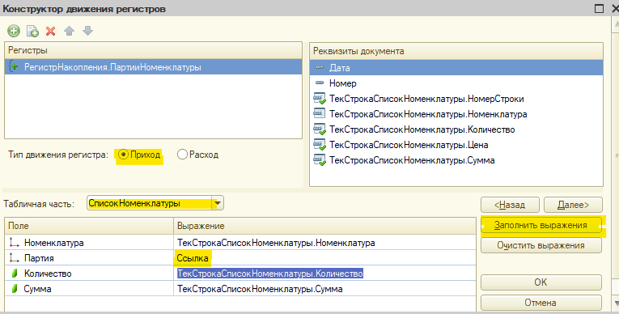
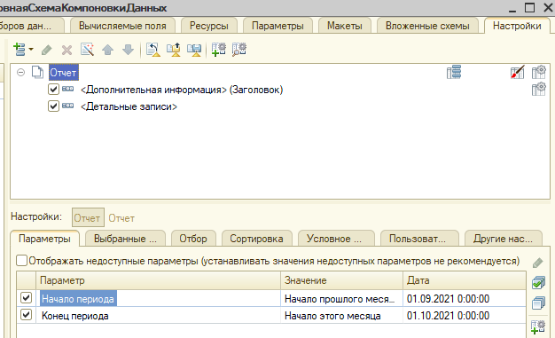
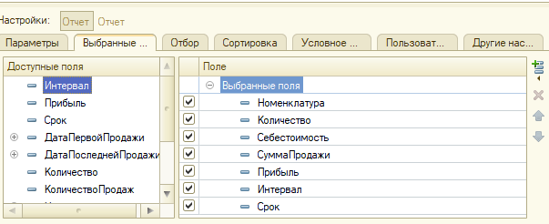
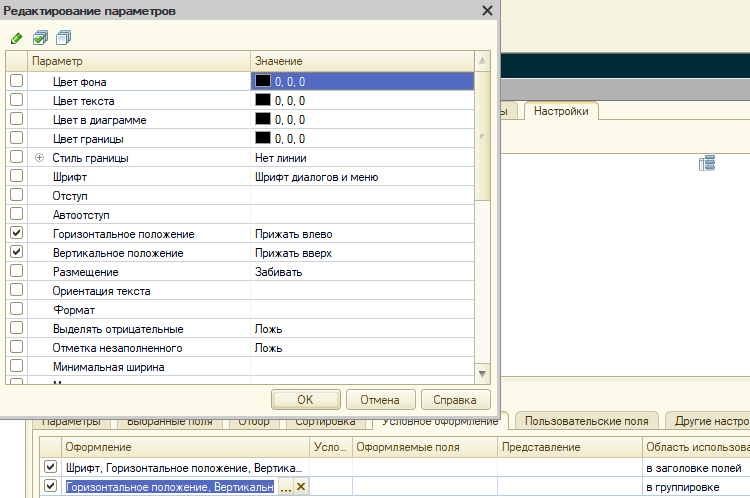

# Билет 2 - решение задачи по опер. учёту

**Дисклеймер** Данные записи, по-сути, практическая выжимка решения, теор. часть практически не разбирается! Поэтому важен теоретических базис от любого доступного источника: Курс 1С УЦ, Курс Гилёва, Курс Чистова, практическое пособие разработчика и т.д.

## Анализ билета

Выделяем ключевые особенности решения 1-2 словами, чтобы потом по этому чек-листу разрабатывать решение

* Используемые документы: "Приходная накладная", "Расходная накладная"
* Есть услуги в одной ТЧ
* Партия указывается в документе вручную
* Требуется проверка остатков при списании
* Отчет сложный, требует доп. анализа

Каждая особенность влияет на решение и настройку метаданных

**Проектирование регистра начинается с анализа отчета!**

* В отчете 1 аналитика: *Номенклатура*

* В отчете 3 получаемых показателя и 3 расчетных
  
  * сколько у нас расчетных - прямо сказано в ТЗ
  * Расчетные показатели:
    * *Прибыль* - *Сумма продаж* - *Себестоимость*
    * *Интервал* - *Дата первой отгрузки* - *Дата последней отгрузки* / *Количество отгрузок*
    * *Срок* - *Конец периода отчета* - *Дата последней отгрузки*

* Дальше тезисно формулируем нюансы задачи
  
  * Отчет строится за период, т.е. это обороты по номенклатуре

  * В отчете должна быть *Сумма продаж*

  * Для контроля остатков нам нужен регистр *Остатки* с разрезами *Номенклатура* и *Партия* и показателями *Количество* и *Себестоимость*

  * *Себестоимость* <> *Сумма продаж* - это разные показатели

  * В регистр остатков сумму продаж добавлять нельзя, ведь тогда её придётся выводить в ноль, а это абсурд

* Итого, нужен 1 остаточный регистр (для контроля остатков) и 1 оборотный (для отчета)
  * **ВАЖНО** Все ресурсы, нужны для отчета заводим в оборотный регистр, иначе будет сложный запрос и попадёте на ошибку "неоптимальное решение"

## Ход решения билета

### Настраиваем объекты метаданных

* Добавляем реквизит *"Вид номенклатуры"* для справочника *"Номенклатура"*
  * Имя *"ВидНоменклатуры"* (тип: *"ПеречислениеСсылка.ВидНоменклатуры"* или *булево*)
  * требуется для *"Есть услуги в одной ТЧ"*

* Дорабатываем документ *Расходная накладная*
  * Добавляем в ТЧ реквизит: *Партия* (тип: *ДокументСсылка.ПриходнаяНакладная*)
    * Так как в ТЗ ничего не сказано, НЕ НАДО делать отборы вида: видеть документы по выбранной номенклатуре и т.д. и т.п.
    * Не забываем ставить признак *Проверка заполнения* в *Выдавать ошибку*
  * требуется для *"Партия указывается в документе вручную"*

* Настраиваем регистр *"ОстаткиНоменклатуры"*
  
  * Измерения:
    * Измерение *"Номенклатура"*
      * Ставим признак *"Запрет незаполненных значений"*
    * Добавляем измерение *Партия* (тип: *ДокументСсылка.ПриходнаяНакладная*)
      * Ставим признак *"Запрет незаполненных значений"*

  * Ресурсы:
    * Количество (тип: *Число(10,0)*)
    * Себестоимость (тип: *Число(12,2)*)
  
  * Регистраторы:
    * *"ПриходнаяНакладная"*, *"РасходнаяНакладная"*
  
  * Включаем режим разделения итогов (последняя вкладка)
  * Требуется для *Требуется проверка остатков при списании*

* Добавляем новый регистр *"Продажи"*

  * Измерения:
    * *Номенклатура* (тип: *СправочникСсылка.Номенклатура*)

  * Ресурсы:
    * Количество (тип: *Число(10,0)*)
    * Себестоимость (тип: *Число(12,2)*)
    * СуммаПродажи (тип: *Число(12,2)*)

  * Регистраторы:
    * *"РасходнаяНакладная"*

  * Проверяем что включен режим разделения итогов (последняя вкладка)
  * Требуется для *Отчет сложный...*

### Настройка документа "Приходная накладная"

* Для ускорения процесса первичные движения всегда накидываем через конструктор движений
  * Обратите внимание, у меня регистр переименован - так делать НЕ НАДО! или создайте свой или не меняйте имя (я тогда забыл, что не надо трогать объекты метаданных самой каркасной)
  * Обратите внимание, тут испробован метод формирования движений БЕЗ конструктора - запросом (см. код и пояснения к нему)



* Результат

```1C

    // регистр ПартииНоменклатуры Приход
    Движения.ПартииНоменклатуры.Записывать = Истина;
    Для Каждого ТекСтрокаСписокНоменклатуры Из СписокНоменклатуры Цикл
        Движение = Движения.ПартииНоменклатуры.Добавить();
        Движение.ВидДвижения = ВидДвиженияНакопления.Приход;
        Движение.Период = Дата;
        Движение.Номенклатура = ТекСтрокаСписокНоменклатуры.Номенклатура;
        Движение.Партия = Ссылка;
        Движение.Количество = ТекСтрокаСписокНоменклатуры.Количество;
        Движение.Сумма = ТекСтрокаСписокНоменклатуры.Сумма;
    КонецЦикла;

```

* Дорабатываем алгоритм, чтобы отфильтровать услуги
  * тут я, кстати, попробовал подход БЕЗ КОНСТРУКТОРА - через формирование движений в запросе и загрузку результата
    * по времени выходит плюс минус тоже самое, если знаете, что делать и как делать это быстро

```1C
    Запрос = Новый Запрос;
    Запрос.Текст = 
        "ВЫБРАТЬ
        |    &ДатаДок КАК Период,
        |    ПриходнаяНакладнаяСписокНоменклатуры.Номенклатура КАК Номенклатура,
        |    ПриходнаяНакладнаяСписокНоменклатуры.Ссылка КАК Партия,
        |    СУММА(ПриходнаяНакладнаяСписокНоменклатуры.Количество) КАК Количество,
        |    СУММА(ПриходнаяНакладнаяСписокНоменклатуры.Сумма) КАК Сумма,
        |    ЗНАЧЕНИЕ(ВидДвиженияНакопления.Приход) КАК ВидДвижения
        |ИЗ
        |    Документ.ПриходнаяНакладная.СписокНоменклатуры КАК ПриходнаяНакладнаяСписокНоменклатуры
        |ГДЕ
        |    ПриходнаяНакладнаяСписокНоменклатуры.Ссылка = &Ссылка
        |    И ПриходнаяНакладнаяСписокНоменклатуры.Номенклатура.ВидНоменклатуры = &ВидНоменклатуры
        |
        |СГРУППИРОВАТЬ ПО
        |    ПриходнаяНакладнаяСписокНоменклатуры.Ссылка,
        |    ПриходнаяНакладнаяСписокНоменклатуры.Номенклатура";
    
    Запрос.УстановитьПараметр("ВидНоменклатуры", Перечисления.ВидыНоменклатуры.Товар);
    Запрос.УстановитьПараметр("Ссылка", Ссылка);
    Запрос.УстановитьПараметр("ДатаДок", Дата);
    
    РезультатЗапроса = Запрос.Выполнить();
    Если НЕ РезультатЗапроса.Пустой() Тогда
        Движения.ПартииНоменклатуры.Записывать = Истина;
        Движения.ПартииНоменклатуры.Загрузить(РезультатЗапроса.Выгрузить());
    КонецЕсли;

```

### Настройка документа "Расходная накладная"

* Для ускорения процесса первичные движения всегда накидываем через конструктор движений
  * тут я и далее на этом подробно останавливаться не буду

* Ключевые точки алгоритма

  * Поставить признак записи и очистить прошлые записи регистра
    * это критически важно для корректного перепроведения документов
  
  * Определить методику проведения для каждого регистра
  
    * ПартииНоменклатуры - старая методика, так как для получения данных по себестоимости нужна информация из регистра
      * ставим блокировку *БлокировкаДанных* по измерению "*Номенклатура*" с отбором по ТЧ
      * читаем партии на *МоментВремени*
      * проверяем, что кол-ва хватает, если нет ОТКАЗ = истина и вывод ошибок (не забываем про *Представление*)
      * Если хватает - заполняем движения

      * А почему нельзя достать себестоимость из документа прихода и использовать новую методику?
        * запрос к другим документам на экзамене делать запрещено, т.к. *документ не является источником достоверной информации* (цитата из правил)
        * это не избавит от проблемы копеек, т.к. вы не знаете, сколько по данной партии осталось

    * Продажи - оборотный регистр тут ни о каком контроле нет речи, поэтому и методик нет. просто пишем движения
  
  * Сделать движения по регистру "Партии номенклатуры" (старая методика)
    * Не забываем про *проблему копеек*, т.е. если кол-во документа = кол-ву по партии - списать всю себестоимость без вычислений
  
  * Сделать движения по регистру "Продажи"
    * НЕ забываем, что сюда НАДО добавить услуги следовательно сюда надо записать все строки из документа!

```1C
    Движения.ПартииНоменклатуры.Записывать = Истина;
    Движения.ПартииНоменклатуры.Записать();
    
    Движения.Продажи.Записывать = Истина; // движения чистить не обязательно
    
    Блокировка = Новый БлокировкаДанных;
    ЭлементБлокировки = Блокировка.Добавить("РегистрНакопления.ПартииНоменклатуры");
    ЭлементБлокировки.Режим = РежимБлокировкиДанных.Исключительный;
    ЭлементБлокировки.ИсточникДанных = СписокНоменклатуры;
    ЭлементБлокировки.ИспользоватьИзИсточникаДанных("Номенклатура", "Номенклатура");
    ЭлементБлокировки.ИспользоватьИзИсточникаДанных("Партия", "Партия");
    Блокировка.Заблокировать();
    
    Запрос = Новый Запрос;
    Запрос.МенеджерВременныхТаблиц = Новый МенеджерВременныхТаблиц;
    Запрос.Текст = 
    "ВЫБРАТЬ
    |    РасходнаяНакладнаяСписокНоменклатуры.Номенклатура КАК Номенклатура,
    |    СУММА(РасходнаяНакладнаяСписокНоменклатуры.Количество) КАК Количество,
    |    СУММА(РасходнаяНакладнаяСписокНоменклатуры.Сумма) КАК СуммаПродажи,
    |    РасходнаяНакладнаяСписокНоменклатуры.Партия КАК Партия
    |ПОМЕСТИТЬ ВТ_ДанныеДок
    |ИЗ
    |    Документ.РасходнаяНакладная.СписокНоменклатуры КАК РасходнаяНакладнаяСписокНоменклатуры
    |ГДЕ
    |    РасходнаяНакладнаяСписокНоменклатуры.Ссылка = &Ссылка
    |
    |СГРУППИРОВАТЬ ПО
    |    РасходнаяНакладнаяСписокНоменклатуры.Номенклатура,
    |    РасходнаяНакладнаяСписокНоменклатуры.Партия
    |
    |ИНДЕКСИРОВАТЬ ПО
    |    Номенклатура,
    |    Партия
    |;
    |
    |////////////////////////////////////////////////////////////////////////////////
    |ВЫБРАТЬ
    |    ВТ_ДанныеДок.Номенклатура КАК Номенклатура,
    |    ВТ_ДанныеДок.Количество КАК Количество,
    |    ВЫБОР
    |        КОГДА ВТ_ДанныеДок.Номенклатура.ВидНоменклатуры = &ВидНоменклатуры
    |            ТОГДА ИСТИНА
    |        ИНАЧЕ ЛОЖЬ
    |    КОНЕЦ КАК ЭтоТовар,
    |    ЕСТЬNULL(ПартииНоменклатурыОстатки.КоличествоОстаток, 0) КАК КоличествоПартии,
    |    ЕСТЬNULL(ПартииНоменклатурыОстатки.СуммаОстаток, 0) КАК СуммаПартии,
    |    ВТ_ДанныеДок.СуммаПродажи КАК СуммаПродажи,
    |    ВТ_ДанныеДок.Номенклатура.Представление КАК НоменклатураПредставление,
    |    ВТ_ДанныеДок.Партия.Представление КАК ПартияПредставление,
    |    ВТ_ДанныеДок.Партия КАК Партия
    |ИЗ
    |    ВТ_ДанныеДок КАК ВТ_ДанныеДок
    |        ЛЕВОЕ СОЕДИНЕНИЕ РегистрНакопления.ПартииНоменклатуры.Остатки(
    |                &МоментВремени,
    |                (Номенклатура, Партия) В
    |                    (ВЫБРАТЬ
    |                        ВТ_ДанныеДок.Номенклатура КАК Номенклатура,
    |                        ВТ_ДанныеДок.Партия КАК Партия
    |                    ИЗ
    |                        ВТ_ДанныеДок КАК ВТ_ДанныеДок)) КАК ПартииНоменклатурыОстатки
    |        ПО ВТ_ДанныеДок.Номенклатура = ПартииНоменклатурыОстатки.Номенклатура
    |            И ВТ_ДанныеДок.Партия = ПартииНоменклатурыОстатки.Партия";
    
    Запрос.УстановитьПараметр("ВидНоменклатуры", Перечисления.ВидыНоменклатуры.Товар);
    Запрос.УстановитьПараметр("МоментВремени", МоментВремени());
    Запрос.УстановитьПараметр("Ссылка", Ссылка);
    
    РезультатЗапроса = Запрос.Выполнить();
    
    Выборка = РезультатЗапроса.Выбрать();
    
    Пока Выборка.Следующий() Цикл
        
        Если Выборка.ЭтоТовар Тогда
            
            НеХватает = Выборка.Количество - Выборка.КоличествоПартии;
            Если НеХватает > 0 Тогда
                
                Отказ = Истина;
                Сообщение = Новый СообщениеПользователю;
                Сообщение.Текст = СтрШаблон("Не хватает товара: %1 по партии: %2 в количестве: %3", Выборка.НоменклатураПредставление, Выборка.ПартияПредставление, НеХватает);
                Сообщение.Сообщить();
                
            КонецЕсли;
            
            Если Отказ Тогда
                Продолжить;
            КонецЕсли;
            
            Себестоимость = ?(Выборка.Количество = Выборка.КоличествоПартии, 
            Выборка.СуммаПартии, 
            Выборка.Количество * Выборка.СуммаПартии / Выборка.КоличествоПартии);
            
            Движение = Движения.ПартииНоменклатуры.Добавить();
            Движение.ВидДвижения = ВидДвиженияНакопления.Расход;
            Движение.Период = Дата;
            Движение.Номенклатура = Выборка.Номенклатура;
            Движение.Партия = Выборка.Партия;
            Движение.Количество = Выборка.Количество;
            Движение.Сумма = Себестоимость;
            
            Движение = Движения.Продажи.Добавить();
            Движение.Период = Дата;
            Движение.Номенклатура = Выборка.Номенклатура;
            Движение.Количество = Выборка.Количество;
            Движение.Себестоимость = Себестоимость;
            Движение.СуммаПродажи = Выборка.СуммаПродажи;
        ИНаче
            
            Движение = Движения.Продажи.Добавить();
            Движение.Период = Дата;
            Движение.Номенклатура = Выборка.Номенклатура;
            Движение.Количество = Выборка.Количество;
            Движение.Себестоимость = 0;
            Движение.СуммаПродажи = Выборка.СуммаПродажи;
            
        КонецЕсли;
    
    КонецЦикла;
```

### Подготовка отчета

* Не забываем соблюдать [общие требования к отчету](Требования_к_Отчетам.md)

* Все нюансы настройки отчета привести невозможно, поэтому только ключевые моменты
  * Вот запрос данного отчета:
  
```1C
ВЫБРАТЬ
    ПродажиОбороты.Номенклатура КАК Номенклатура,
    ПродажиОбороты.КоличествоОборот КАК Количество,
    ПродажиОбороты.СебестоимостьОборот КАК Себестоимость,
    ПродажиОбороты.СуммаПродажиОборот КАК СуммаПродажи,
    МАКСИМУМ(ПродажиОборотыПоРегистратору.Регистратор.Дата) КАК ДатаПоследнейПродажи,
    МИНИМУМ(ПродажиОборотыПоРегистратору.Регистратор.Дата) КАК ДатаПервойПродажи,
    КОЛИЧЕСТВО(РАЗЛИЧНЫЕ ПродажиОборотыПоРегистратору.Регистратор) КАК КоличествоПродаж,
    ВЫБОР
        КОГДА ПродажиОбороты.Номенклатура.ВидНоменклатуры = &ВидНоменклатуры
            ТОГДА ИСТИНА
        ИНАЧЕ ЛОЖЬ
    КОНЕЦ КАК ЭтоТовар,
    0 КАК Прибыль,
    0 КАК Интервал,
    0 КАК Срок
ИЗ
    РегистрНакопления.Продажи.Обороты КАК ПродажиОбороты
        ВНУТРЕННЕЕ СОЕДИНЕНИЕ РегистрНакопления.Продажи.Обороты(, , Регистратор, ) КАК ПродажиОборотыПоРегистратору
        ПО ПродажиОбороты.Номенклатура = ПродажиОборотыПоРегистратору.Номенклатура

СГРУППИРОВАТЬ ПО
    ПродажиОбороты.Номенклатура,
    ПродажиОбороты.КоличествоОборот,
    ПродажиОбороты.СебестоимостьОборот,
    ПродажиОбороты.СуммаПродажиОборот,
    ВЫБОР
        КОГДА ПродажиОбороты.Номенклатура.ВидНоменклатуры = &ВидНоменклатуры
            ТОГДА ИСТИНА
        ИНАЧЕ ЛОЖЬ
    КОНЕЦ
```

* Как вычислить доп. параметры по ТЗ
  
  * Есть 2 варианта: делать это в вычисляемых полях или в ресурсах, для примера посмотрим, как это реализовано в вычисляемых полях

  

  * Чтобы была надпись "Разовая" используем условное форматирование

  

* Как настроить заголовок разобрано в билете 1

* Делаем настройки отчета
  
  * Задаём структуру
    * Не забываем задать параметры отчета значениями по-умолчанию и включить их в пользовательские настройки

  
  
  * Выбираем список нужных нам полей в нужном порядке
  
  

  * Условное оформление задаём, чтобы заголовок и текст были выравнены как в билете (собственно, повторятся то, что делали в билете 1)

  
  
  * Отключаем вывод параметров и заголовка

  